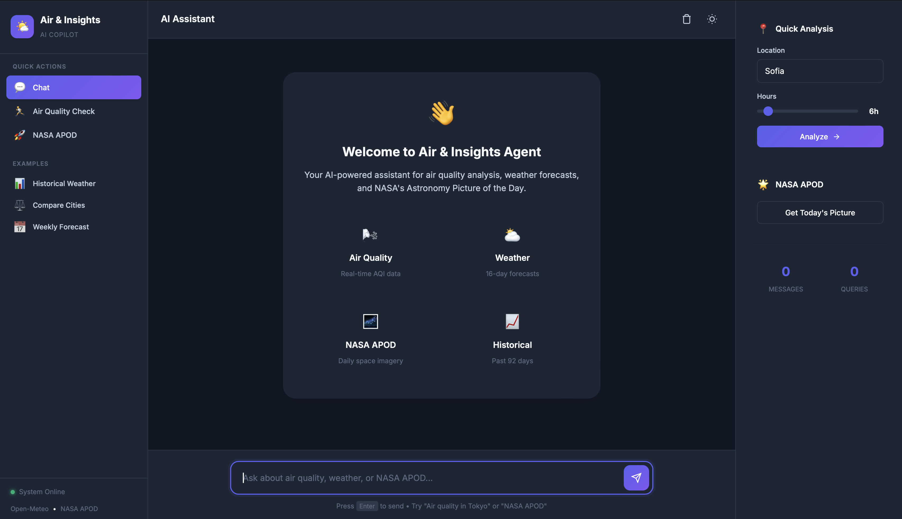
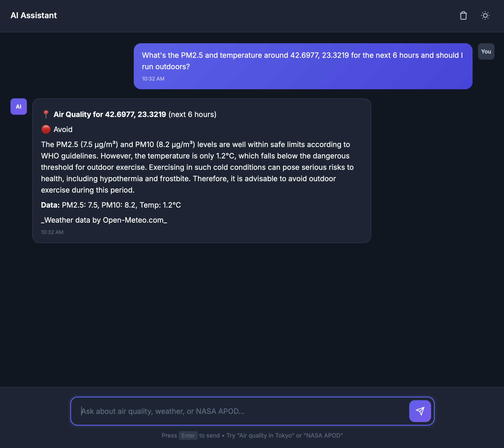
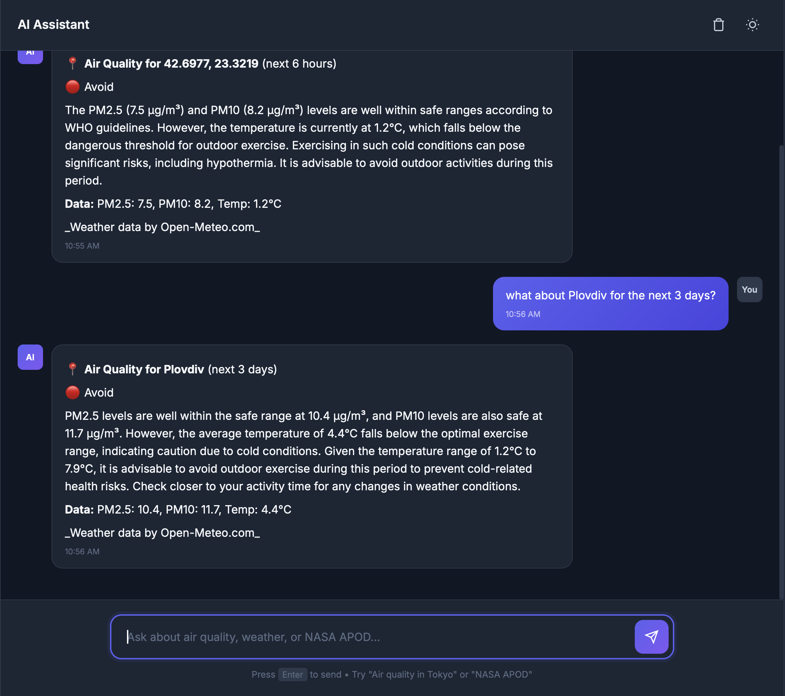
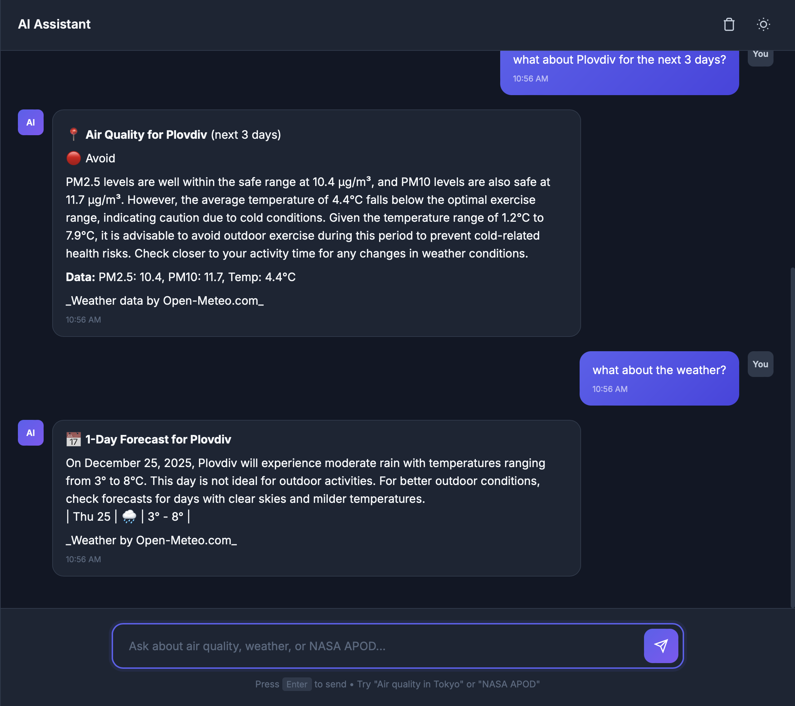
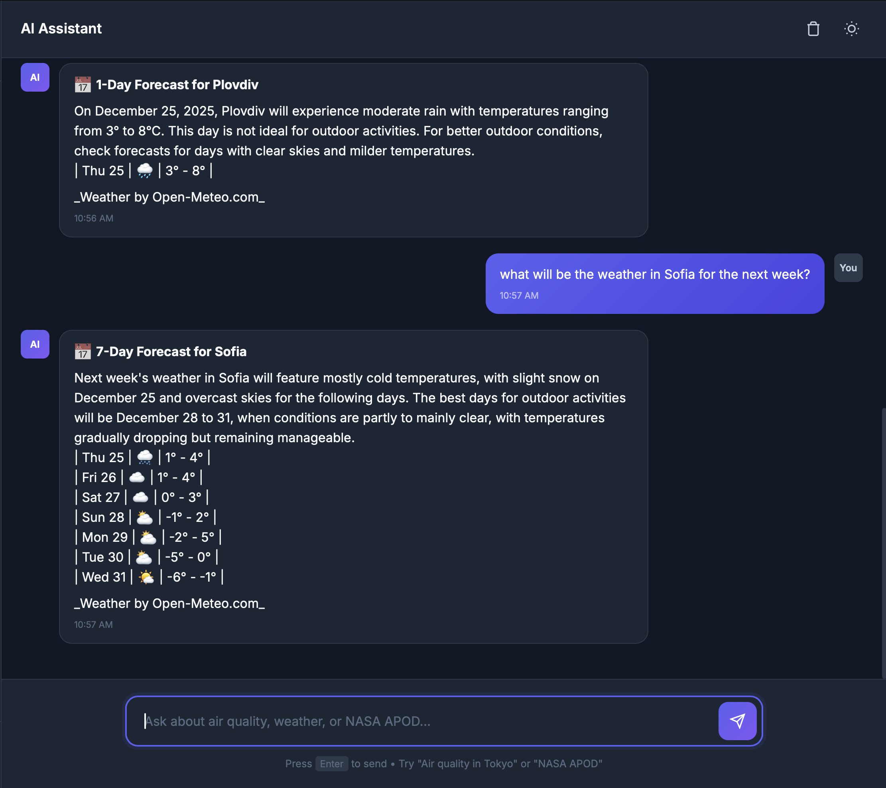
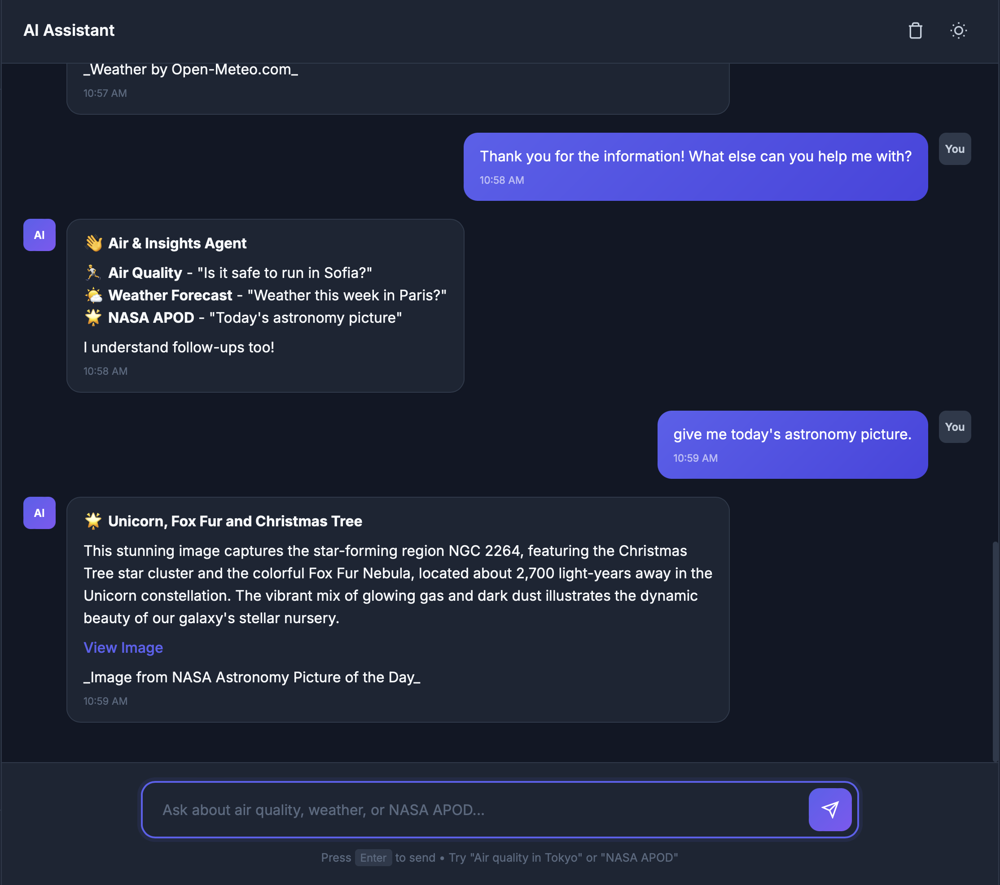
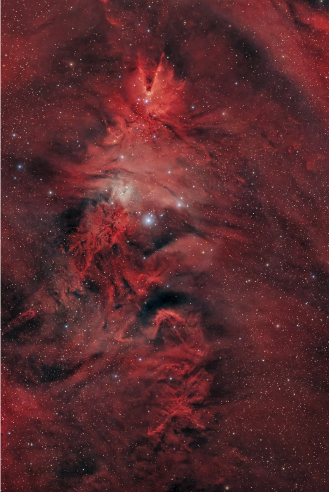

# 🌤️ Air & Insights Agent

> **AI Adoption Specialist Task Submission** 
> Author: Alexander Videnov | December 2025

An **agentic AI assistant** that fetches weather & air quality data from free public APIs, reasons about it with a free LLM (GitHub Models), and provides actionable guidance for outdoor activities.


---

## ✅ Task Requirements

| Requirement | Status | Implementation |
|-------------|--------|----------------|
| Weather/Air Quality from free APIs | ✅ | Open-Meteo API (no key required) |
| LLM reasoning with free model | ✅ | GitHub Models (GPT-4o-mini) |
| Copilot Studio compatible API | ✅ | OpenAPI 3.0 spec at `/docs` |
| POST /analyze endpoint | ✅ | Returns PM2.5, PM10, temp, guidance |
| GET /apod/today endpoint | ✅ | NASA APOD with AI summary |
| Response includes attribution | ✅ | All responses credit data sources |

---

## 🚀 Quick Start

### 1. Clone & Setup

```bash
git clone https://github.com/TheAVengineer/Agentic-Air-Insights-Copilot-.git
cd Agentic-Air-Insights-Copilot-

# macOS/Linux
chmod +x setup.sh && ./setup.sh

# Windows
setup.bat
```

### 2. Add GitHub Token (if prompted)

- Go to https://github.com/settings/tokens
- Generate new token (classic) - no special permissions needed
- Paste when prompted

### 3. Test in Browser

Open **http://localhost:8000/** and try:

**Demo Prompt 1** (Air Quality):
```
What is the PM2.5 and temperature around 42.6977, 23.3219 for the next 6 hours and should I run outdoors?
```

**Demo Prompt 2** (NASA APOD):
```
Show today NASA APOD and summarize in 2 lines.
```

---

## 📸 Screenshots

<details>
<summary><b>Click to view all 7 screenshots</b></summary>

### 1. Web UI Overview
*Main chat interface with quick action buttons*



### 2. Air Quality Analysis (Demo Prompt 1)
*PM2.5, temperature, and safety guidance for coordinates*



### 3. Follow-up: Different City
*What about Plovdiv for the next 3 days?*



### 4. Follow-up: Weather Request
*What about the weather? - Rain forecast*



### 5. 7-Day Forecast
*Weather in Sofia for the next week*



### 6. NASA APOD (Demo Prompt 2)
*Today astronomy picture - Christmas Tree Cluster*



### 7. NASA Image
*The actual NGC 2264 Christmas Tree Cluster*



</details>

---

## ✨ Features

- 🤖 **LLM-First**: Natural language via GitHub Models (GPT-4o-mini)
- 🔄 **Auto Fallback**: Ollama backup when GitHub Models unavailable
- 🌡️ **Air Quality**: PM2.5, PM10, temperature with safety guidance
- 📅 **Forecasts**: Up to 16 days ahead
- 📊 **Historical**: Up to 92 days of past data
- 💬 **Follow-ups**: What about tomorrow? / How about Paris?
- 🌍 **Geocoding**: Cities, countries, or lat/lon coordinates
- 🌟 **NASA APOD**: Daily astronomy picture with AI summary
- 💾 **Caching**: 10-minute TTL to reduce API calls

---

## 🏗️ Project Structure

```
├── main.py              # FastAPI entry point
├── agent/               # Agent logic (orchestrator, query parser)
├── api/                 # Routes and Pydantic models
├── tools/               # Weather, NASA, geocoding clients
├── llm/                 # GitHub Models + Ollama integration
├── policies/            # Safety thresholds (JSON config)
├── ui/                  # Web chat interface
├── tests/               # 652 tests (96% coverage)
└── docs/                # Documentation + screenshots
```

---

## 📖 API Reference

### POST /analyze
```bash
curl -X POST http://localhost:8000/analyze -H "Content-Type: application/json" -d '{"latitude": 42.6977, "longitude": 23.3219, "hours": 6}'
```

### GET /apod/today
```bash
curl http://localhost:8000/apod/today
```

### POST /chat
```bash
curl -X POST http://localhost:8000/chat -H "Content-Type: application/json" -d '{"message": "Is it safe to run in Sofia?"}'
```

---

## 🧪 Testing

```bash
pytest tests/ -v              # Run all 652 tests
pytest --cov=. --cov-report=html  # With coverage
```

---

## 🔌 Copilot Studio Integration

**Track A: Microsoft Stack**

1. Export: `curl http://localhost:8000/openapi.json > openapi.json`
2. Copilot Studio → Create Agent → Add Tool → REST API → Import OpenAPI

See [docs/COPILOT_STUDIO_INTEGRATION.md](docs/COPILOT_STUDIO_INTEGRATION.md) for details.

---

## 🔧 Configuration

| Variable | Required | Description |
|----------|----------|-------------|
| `GITHUB_TOKEN` | Yes | GitHub PAT for Models API |
| `NASA_API_KEY` | No | NASA key (DEMO_KEY works) |
| `PORT` | No | Server port (default: 8000) |

---

## 📝 Attribution

- Weather & Air Quality: [Open-Meteo.com](https://open-meteo.com/)
- NASA Images: [NASA APOD](https://apod.nasa.gov/)
- LLM: [GitHub Models](https://github.blog/2024-07-25-introducing-github-models/)
- Geocoding: [OpenStreetMap Nominatim](https://nominatim.org/)

---

## 📚 Additional Docs

- [Design Document](docs/DESIGN.md)
- [Copilot Studio Guide](docs/COPILOT_STUDIO_INTEGRATION.md)

---

**GitHub**: [TheAVengineer/Agentic-Air-Insights-Copilot-](https://github.com/TheAVengineer/Agentic-Air-Insights-Copilot-)
